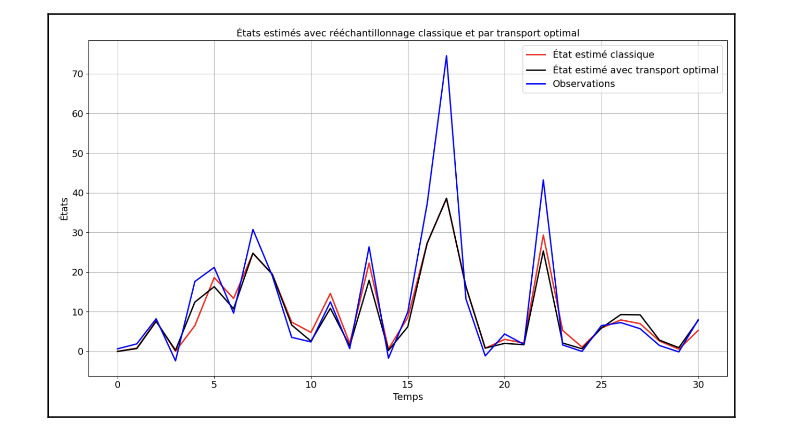
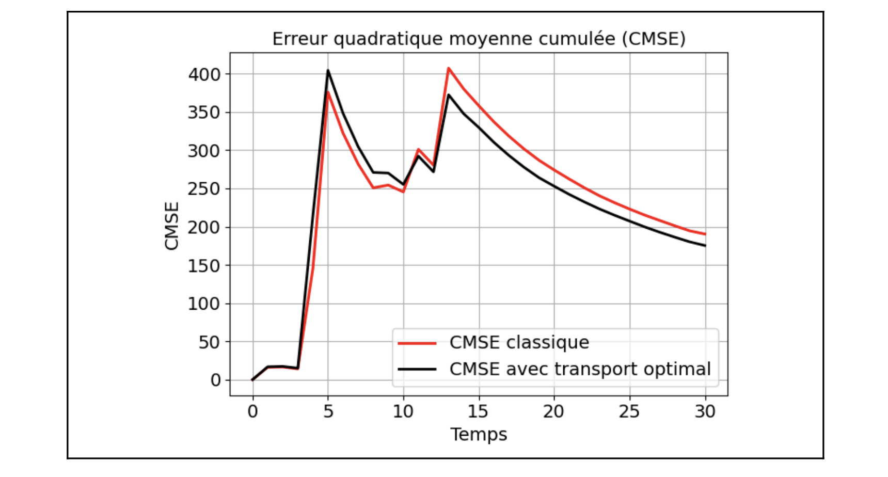

# Differentiable Particle Filter with Entropy-Regularized Optimal Transport

This repository implements a state-of-the-art algorithm to solve a core problem in probabilistic tracking: making particle filters differentiable.

This project was completed for the Cassiopée research program at Télécom SudParis, based on the paper **"Differentiable Particle Filtering via Entropy-Regularized Optimal Transport"** (Corenflos et al.).

---

## The Core Idea (Explained Simply)

#### 1. The Scenario
Imagine trying to track a small, fast robot (the "true state") as it moves through a smoky room, using only a blurry, lagging camera (the "observation").

#### 2. What is a Particle Filter?
A Particle Filter (PF) works by making thousands of 'guesses' (particles) about the robot's real-time position. Based on the blurry camera image, it gives a "score" to each guess. Good guesses get high scores; bad guesses get low scores.

#### 3. The "Non-Differentiable" Problem
A *standard* particle filter then performs a 'survival of the fittest' step called **resampling**. It abruptly **kills** all the low-score guesses and **duplicates** the high-score ones.

* **The Problem:** This "kill/duplicate" step is a hard, discrete on/off switch. You cannot use calculus (i.e., gradient descent) on a hard switch. This means you can't "teach" the filter to get better or automatically tune its own parameters (like a neural network). It is **non-differentiable**.

#### 4. The Solution (This Project)
Our filter uses **Optimal Transport (OT)**. Instead of 'killing' and 'duplicating' guesses, it **smoothly moves** them.

* **The Solution:** It calculates the most efficient way to "shift" all the bad guesses over to the locations of the good guesses. Because this "shifting" is a smooth, continuous process, you *can* use calculus on it.

This makes the entire filter **differentiable**, allowing it to be optimized and integrated into modern deep learning pipelines.

---

## Key Results

We compared our Optimal Transport Particle Filter (OT-PF) against a classical particle filter (with standard resampling) on a state-tracking task.

#### 1. Trajectory Estimation
The OT-PF (black line) successfully tracks the true observations (blue line) and demonstrates a more stable and accurate estimation than the classical filter (red line).



#### 2. Cumulative Mean Squared Error (CMSE)
This is the key result. The CMSE (a measure of total error) of our OT-PF (black line) is **consistently lower** than that of the classical filter (red line). This proves our method is not just differentiable, but also more accurate.



---

## Technical Features & Implementation

* **Optimal Transport PF:** `optimal_transport.py` implements the full particle filter using OT resampling. It uses the `POT (Python Optimal Transport)` library to efficiently solve the entropically-regularized problem using **Sinkhorn's Algorithm**.
* **Auto-Differentiation:** `auto_differentiation.py` provides a proof-of-concept showing how this differentiable filter can be used to estimate model parameters ($Q$ and $R$ noise matrices) via gradient descent.
* **Mathematical Proofs:** The `/Documents` folder contains a full synthesis report and a `Proof_report.pdf` detailing the mathematical derivations, including the dual form of the OT problem, the saddle-point proof, and the entropic regularization derivation.

---

## Installation

This project requires Python 3.x and the following libraries:

```bash
pip install numpy matplotlib
pip install pot
