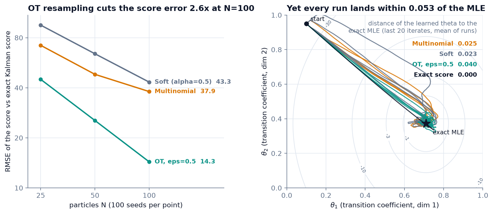
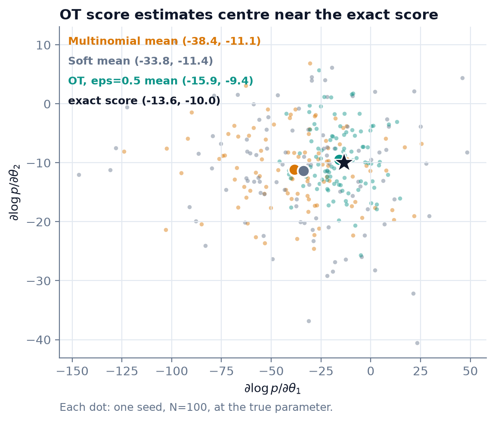
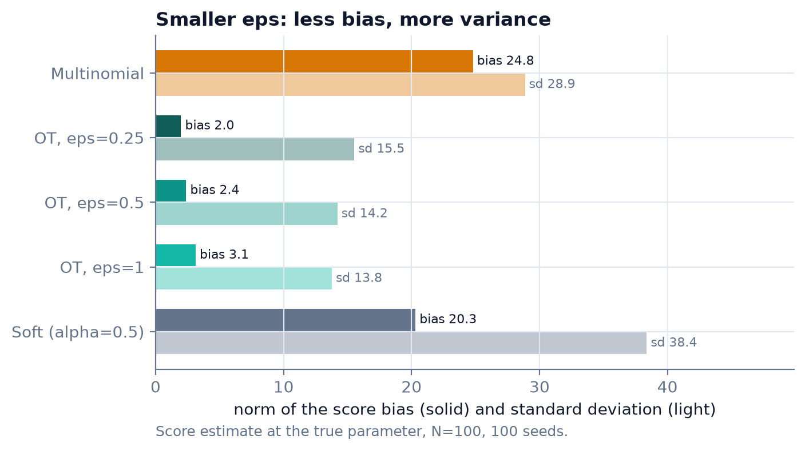
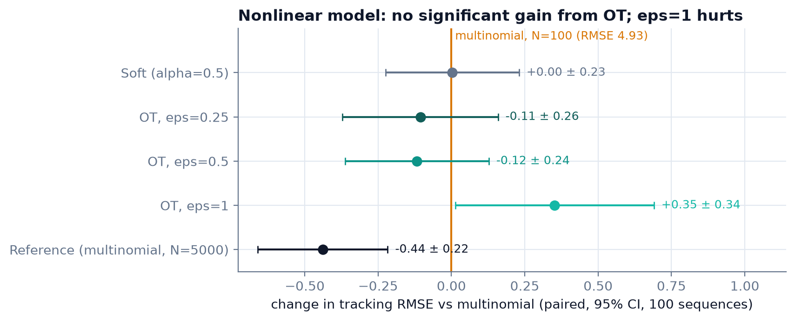

# Particle-Filter-Optimal-Transport

Can a particle filter return gradients good enough to learn a model's parameters? A PyTorch
implementation of optimal-transport resampling (Corenflos et al., ICML 2021), measured against
the exact Kalman score: OT cuts the gradient error 2.6x, yet on this model even the biased
gradients learn the MLE.

[](https://github.com/Pchambet/Particle-Filter-Optimal-Transport/actions/workflows/ci.yml)

[](LICENSE)
[](https://pchambet.github.io/Particle-Filter-Optimal-Transport/)



## TL;DR

- **The textbook gradient's bias is larger than the gradient itself.** At N = 100 particles, over
  100 seeds, the score from a filter with multinomial resampling has a bias of norm 24.8 ± 2.7
  (± 1 SE), against an exact score of norm 16.8. Soft resampling (alpha = 0.5) does not fix it
  (bias 20.3 ± 3.6, RMSE 43.3).
- **OT resampling cuts the score RMSE 2.6x** (14.3 vs 37.9, eps = 0.5) and its bias from
  24.8 ± 2.7 to 2.4 ± 1.2, indistinguishable from zero (p = 0.14).
- **Better gradients did not buy better parameters here.** Adam from a distant start, at N = 50
  (where OT's score bias, 5.8, is still significant but 5x smaller than multinomial's 29.0), lands
  within 0.053 of the exact MLE in every run of every scheme (distance of the average of the last
  20 iterates; mean over runs: multinomial 0.025, soft 0.023, OT 0.040). OT ended slightly
  farther, a gap of the order of the run-to-run spread (sd 0.014) with 5 runs.
- **It is not free:** at N = 100 an OT filter run took 1.2 s against 0.009 s for multinomial,
  about 130x (CPU, indicative).
- **The original 2024 project's claim that OT resampling tracks more accurately is not
  supported.** On a corrected version of its bimodal nonlinear model (standard noise variances,
  100 sequences), OT resampling (eps <= 0.5) is not measurably more accurate than multinomial
  (RMSE change at eps = 0.5: -0.12 ± 0.24, 95% CI); eps = 1 is borderline worse (+0.35 ± 0.34; the CI just
  excludes 0, no multiple-comparison correction).

## Why it matters

State-space models are a standard way to model operations data: a hidden state (demand, wear,
position, congestion) observed through noise. Particle filters estimate their likelihood when no
closed form exists, which is the normal case. Fitting the parameters by gradient descent, or
training a neural component inside the filter, needs the gradient of that estimate. The
resampling step draws discrete ancestor indices, so automatic differentiation silently drops part
of the gradient: the answer is biased. This repository measures how
large that bias is, and what an optimal-transport resampling step buys, on a model where the exact
answer is known.

## Approach

1. **Ground truth.** A 2-D linear-Gaussian model, `x_t = diag(theta) x_{t-1} + N(0, I)`,
   `y_t = x_t + N(0, 0.5^2 I)`, `T = 100`, true `theta = (0.8, 0.5)`. The Kalman filter, written
   in PyTorch, gives the exact log-likelihood; autograd through it gives the exact score. All
   linear-Gaussian results use one simulated sequence (data seed 2026); the 100 seeds below are
   filter seeds, so the bias is conditional on that sequence. Its exact MLE is (0.71, 0.37),
   against a true (0.8, 0.5), a gap within sampling error at T = 100 (about 1.1 standard errors
   per coordinate, from the observed information); learning is measured against the MLE.
2. **Three resampling schemes** inside the same bootstrap filter, resampling at every step:
   - *multinomial*: the textbook draw; autograd treats the ancestor indices as constants;
   - *soft* (Karkus et al., 2018): ancestors drawn from `0.5 w + 0.5 / N`, importance weights
     keep a gradient path to `w`;
   - *optimal transport*: the entropy-regularised OT plan `P` between the weighted particle cloud
     and the uniform one, by log-domain Sinkhorn; particle `j` moves to `N sum_i P_ij x_i`.
     Gradients through the plan come from the implicit function theorem at the Sinkhorn fixed
     point (one linear solve per step), checked against finite differences.
3. **Benchmark.** For N in {25, 50, 100} and 100 seeds each: bias, spread and RMSE of the
   log-likelihood and score estimates at the true parameter.
4. **Decision test.** Adam on each gradient estimate from `theta = (0.1, 0.95)`, compared with
   the exact maximum-likelihood estimate.
5. **Stress test.** A corrected version of the bimodal nonlinear model used by the original 2024
   student project, where averaging particles is risky: the noise variances are 10 and 1 (the
   legacy code used 10 as a standard deviation), N = 100 particles and 100 sequences of 50 steps
   (the legacy run: 500 particles, one unseeded sequence of 30 steps), and the OT step is a true
   barycentric map (the legacy "OT" reduced to multinomial resampling).

## Results

**Gradient accuracy.** Each dot is one seed's score estimate at the true parameter; the star is
the exact Kalman score. The multinomial and soft clouds are centred far to the left of it; the OT
cloud is centred near it.



**The role of eps.** Theory says a smaller eps gives a sharper transport plan: less bias, more
variance. Only the variance half is resolved by 100 seeds. At N = 50, each step down in eps raises
the spread by at least 4.5 standard errors (24.9 to 34.7 from eps = 0.5 to 0.25); at N = 25,
going down to eps = 0.25 does too (3.4 and 3.8 SE); at N = 100, shown in the figure below, the
differences shrink below 2 SE. The bias differences between eps values point the expected way but
stay within 1.6 SE at every N (paired bootstrap over seeds,
[`results/summary_eps_pairs.csv`](results/summary_eps_pairs.csv)). What is clear: every OT
variant has a lower bias and a lower spread than both baselines at N = 100.



| N = 100, 100 seeds | log-lik bias | log-lik sd | score bias ± SE | p (bias = 0) | score sd | score RMSE | s / run |
| --- | ---: | ---: | ---: | ---: | ---: | ---: | ---: |
| Multinomial | -5.96 | 3.31 | 24.80 ± 2.73 | < 0.001 | 28.87 | 37.95 | 0.009 |
| Soft (alpha = 0.5) | -9.62 | 5.07 | 20.31 ± 3.63 | < 0.001 | 38.38 | 43.26 | 0.012 |
| OT, eps = 0.25 | -5.53 | 3.73 | 1.99 ± 1.18 | 0.33 | 15.53 | 15.58 | 3.34 |
| OT, eps = 0.5 | -5.64 | 3.77 | 2.39 ± 1.17 | 0.14 | 14.21 | 14.34 | 1.20 |
| OT, eps = 1 | -5.79 | 3.82 | 3.13 ± 1.20 | 0.02 | 13.78 | 14.06 | 0.64 |

The SE of the bias norm is bootstrapped over seeds; the p-value is a Wald test that the bias
vector is zero.

The log-likelihood estimates themselves are almost unaffected by the resampling scheme (soft
resampling excepted): the difference is in the gradient. Full table for N = 25, 50, 100 in
[`results/summary_gradients.csv`](results/summary_gradients.csv).

**Learning** (right panel of the hero figure). Adam, 150 steps, learning rate 0.02, N = 50,
5 runs per scheme; the distance to the MLE is that of the average of the last 20 iterates. At
N = 50 and eps = 0.5, OT's score bias is still significant (5.8, p = 0.0002) but 5x smaller than
multinomial's (29.0). All three schemes reach the neighbourhood of the MLE, the star at
(0.71, 0.37); the exact-score path is the reference ([`results/summary_learning.csv`](results/summary_learning.csv)).

**Nonlinear model.** The corrected growth model of the original project (`y = x^2 / 20 + noise`, bimodal
posterior), 100 sequences of length 50, N = 100, paired against multinomial resampling. A
reference filter with 5,000 particles shows the room for improvement (-0.44).



## Reproduce

```bash
make setup     # uv sync --locked (Python 3.12, PyTorch CPU)
make data      # simulate the observation sequences (seeded) into data/simulated/
make run       # the four experiments -> results/*.csv, then docs/figures/*.png
make report    # site/index.html, the interactive report
make test      # 29 tests, ~10 s
```

`make run` took about 50 minutes on a 10-core laptop shared with other jobs (3 torch threads); the
OT filters dominate. Disk: under 2 MB of results. No download: every dataset is simulated from a
fixed seed, which is what makes an exact ground truth possible.

## Repository layout

```
src/otpf/
  sinkhorn.py     log-domain Sinkhorn, implicit-function gradients
  resampling.py   multinomial, soft and optimal-transport resampling
  filter.py       bootstrap particle filter (batched over seeds)
  kalman.py       exact log-likelihood and score (ground truth)
  models.py       linear-Gaussian and Kitagawa models, reparameterised noise
  learn.py        exact MLE (L-BFGS) and Adam on any gradient source
  experiments.py  the four experiments
  figures.py, report.py, summary.py, cli.py
tests/            Sinkhorn, Kalman, filter, statistics and CLI tests (finite differences, closed forms)
results/          experiment outputs (CSV) used by the figures and this README
docs/figures/     static figures
site/             interactive report (make report)
notes/            optimal transport notes, NAIST workshop (May 2025)
docs/cassiopee-2024/  the original student project reports (French)
legacy/           the original 2024 code, kept for the record (see legacy/README.md)
Makefile          setup, data, run, figures, report, test, lint
```

`otpf <command> --quick` runs a seconds-long smoke version of any step and writes under `quick/`
(gitignored), so it never overwrites the committed results.

## Methodology notes and limitations

- **One observation sequence.** Every linear-Gaussian result (bias, RMSE, p-values, learning)
  is conditional on a single simulated sequence (T = 100, data seed 2026); the 100 seeds are
  particle-filter seeds, not datasets. A bias that depends on the data could differ on another
  sequence.
- **One small, friendly model.** Two parameters, d = 2, where the Kalman filter is exact. The point
  is a ground truth, not scale. The finding that biased gradients still learn well may not carry
  over to models where the bias points away from the optimum; this benchmark does not show such a
  case.
- **The score bias is measured at the true parameter only**, not along the optimisation path.
- **OT is biased for any fixed eps > 0.** The barycentric map shrinks the particle cloud. eps is
  defined on particles standardised per dimension, so it is comparable across steps, but there is
  no automatic choice here.
- **Cost.** O(N^2) memory and time per step plus a Sinkhorn loop whose length grows as eps
  shrinks. Timings were taken on a laptop shared with other jobs; read them as orders of magnitude.
- **Gradients through Sinkhorn** use the implicit function theorem at the fixed point, exact up to
  the solver tolerance (L1 marginal error 1e-6; a warning is raised if the iteration cap is hit
  first), and verified against finite differences in the tests. Unrolling would keep an N x N
  tensor per Sinkhorn iteration on the autograd tape, so the fixed point is differentiated
  instead.
- **Few learning repeats** (5 per scheme) and a fixed learning rate: distances to the MLE are
  indicative, not a ranking.
- On the nonlinear model, the borderline eps = 1 degradation is consistent with the plan averaging particles
  across the two modes of the posterior; that mechanism was not tested separately.

## Background

This started as a Télécom SudParis research project (Cassiopée, 2023-2024, supervised by
Yohan Petetin) with Mael Spangenberger and Léo Ritchie; the team's reports, including the
derivations of the OT dual and of the entropic regularisation, are in
[`docs/cassiopee-2024/`](docs/cassiopee-2024/) (in French). They and the legacy code are the
team's joint work, kept for reference outside the MIT licence. A later review found that the
original code did not demonstrate what it claimed: its "OT" resampling reduced to multinomial
resampling and nothing was differentiated through the transport plan
([details](legacy/README.md)). The package in `src/otpf/` is a rebuild from scratch, with the
claims re-tested.

[`notes/`](notes/) holds my optimal transport notes from a workshop at NAIST (Nara Institute of
Science and Technology), May 2025: an 18-page introduction from Monge to Brenier, and a review of
*Generative Modeling with Optimal Transport Maps* (ICLR 2022).

## References

- A. Corenflos, J. Thornton, G. Deligiannidis, A. Doucet. *Differentiable Particle Filtering via
  Entropy-Regularized Optimal Transport.* ICML 2021. [arXiv:2102.07850](https://arxiv.org/abs/2102.07850)
- P. Karkus, D. Hsu, W. S. Lee. *Particle Filter Networks with Application to Visual
  Localization.* CoRL 2018. [arXiv:1805.08975](https://arxiv.org/abs/1805.08975)
- M. Cuturi. *Sinkhorn Distances: Lightspeed Computation of Optimal Transport.* NeurIPS 2013.
- G. Luise, A. Rudi, M. Pontil, C. Ciliberto. *Differential Properties of Sinkhorn Approximation
  for Learning with Wasserstein Distance.* NeurIPS 2018.
- G. Peyré, M. Cuturi. *Computational Optimal Transport.* Foundations and Trends in Machine
  Learning, 2019.
- N. J. Gordon, D. J. Salmond, A. F. M. Smith. *Novel approach to nonlinear/non-Gaussian Bayesian
  state estimation.* IEE Proceedings F, 1993 (bootstrap filter and the growth model of experiment 4).

---

Built by [Pierre Chambet](https://github.com/Pchambet) — decision science for operations under uncertainty.
